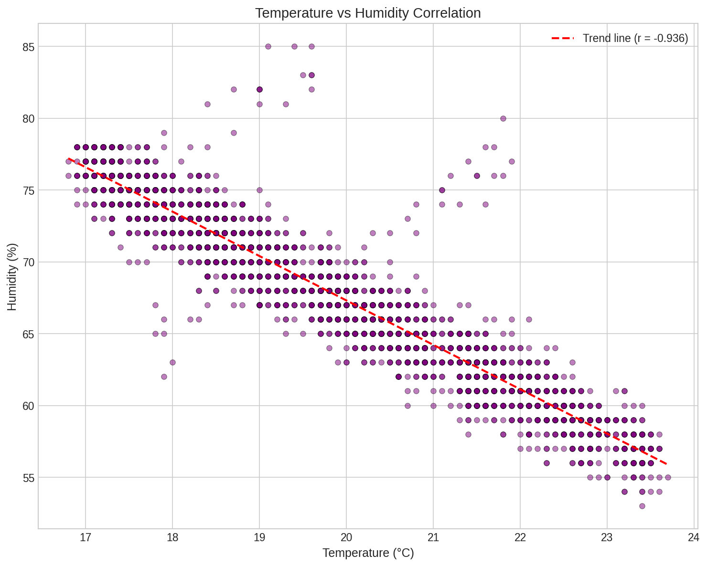

# DHT11 Statistics Dashboard 📊🌡️

A hands-on Raspberry Pi project for learning probability and statistics concepts through real sensor data collection and analysis.


## Overview

This project uses a DHT11 temperature/humidity sensor connected to a Raspberry Pi to:

1. **Collect real environmental data** — Sample temperature and humidity over time
2. **Implement statistics from scratch** — Mean, variance, correlation, hypothesis testing without numpy
3. **Visualize distributions** — Histograms, box plots, time series, probability density functions
4. **Learn by doing** — Understand stats concepts through physical data you collected

Built as preparation for USD's MS in Applied Artificial Intelligence (AAI 500: Probability & Statistics).

## Sample Output

### Temperature & Humidity Over Time


### Temperature vs Humidity Correlation


*Data shown is from an overnight collection in San Diego, CA (December 2024)*

## Hardware Requirements

| Component | Notes |
|-----------|-------|
| Raspberry Pi 4/5 | Any model with GPIO works |
| DHT11 Sensor | 3-pin module recommended (has built-in resistor) |
| Jumper wires | Female-to-female |
| Breadboard | Optional but helpful |

**Total cost: ~$50-60**

## Wiring

```
DHT11 Module          Raspberry Pi
─────────────         ─────────────
VCC (or +)    ───────► Pin 1 (3.3V)
DATA (or S)   ───────► Pin 7 (GPIO4)
GND (or -)    ───────► Pin 6 (GND)
```

## Installation

### On Raspberry Pi

```bash
# Clone the repo
git clone https://github.com/YOUR_USERNAME/dht11-stats-dashboard.git
cd dht11-stats-dashboard

# Create virtual environment
python3 -m venv venv
source venv/bin/activate

# Install dependencies
pip install -r requirements.txt
```

### Dependencies

For sensor reading:
```bash
pip install adafruit-circuitpython-dht
sudo apt install libgpiod2  # May vary by OS version
```

For visualization:
```bash
pip install matplotlib numpy
```

## Usage

### 1. Test Your Sensor

```bash
python test_sensor.py
```

Expected output:
```
DHT11 Sensor Test
Press Ctrl+C to exit

Temp: 23.3°C (73.9°F) | Humidity: 57.0%
Temp: 23.3°C (73.9°F) | Humidity: 57.0%
```

### 2. Collect Data

```bash
python data_collector.py
```

Edit the config at the top of the file:
```python
SAMPLE_INTERVAL = 10      # seconds between readings
READINGS_TARGET = 500     # total readings to collect
OUTPUT_FILE = "sensor_data.csv"
```

For overnight collection, use `screen` or `tmux`:
```bash
screen -S datacollect
python data_collector.py
# Ctrl+A, D to detach
# screen -r datacollect to reattach
```

### 3. Analyze Data

```bash
python stats_analysis.py
```

Output includes:
- Descriptive statistics (mean, median, mode, std dev)
- Quartiles and IQR
- Outlier detection
- Correlation analysis
- Hypothesis testing
- Frequency distribution

### 4. Generate Visualizations

```bash
python visualize.py
```

Creates:
- `01_timeseries.png` — Temperature and humidity over time
- `02_histograms.png` — Frequency distributions
- `03_boxplots.png` — Quartile visualization
- `04_correlation.png` — Scatter plot with trend line
- `05_pdf.png` — Observed vs theoretical normal distribution
- `06_rolling.png` — Rolling mean and standard deviation

### 5. Simulate Data (Optional)

Don't have a sensor yet? Generate realistic data:

```bash
python generate_simulated_data.py
```

Simulates an overnight temperature pattern for San Diego, CA including:
- Exponential cooling curve (Newton's Law of Cooling)
- HVAC cycling
- Random events (bathroom trips, drafts)
- Realistic temp/humidity correlation

## Statistics Concepts Covered

| Concept | Implementation |
|---------|----------------|
| Mean, Median, Mode | `stats_analysis.py` |
| Variance & Std Dev | Sample vs population formulas |
| Quartiles & IQR | Manual calculation |
| Z-scores | Outlier detection |
| Correlation | Pearson coefficient from scratch |
| Covariance | Understanding variable relationships |
| Confidence Intervals | 95% CI for the mean |
| Hypothesis Testing | One-sample t-test |
| Probability Distributions | Frequency histograms, PDF comparison |
| Rolling Statistics | Moving average, rolling std dev |

## Project Structure

```
dht11-stats-dashboard/
├── README.md
├── requirements.txt
├── test_sensor.py          # Verify sensor wiring
├── data_collector.py       # Collect data to CSV
├── stats_analysis.py       # Statistical analysis (no numpy)
├── visualize.py            # Generate charts
├── generate_simulated_data.py  # Create realistic test data
└── images/                 # Sample output charts
```

## Example Analysis Output

```
============================================================
  TEMPERATURE ANALYSIS (°C)
============================================================

Descriptive Statistics:
  Mean:       19.88°C
  Median:     19.80°C
  Mode:       18.4°C
  Std Dev:    1.826°C
  Variance:   3.3347
  Range:      6.9°C

Quartiles:
  Q1 (25%):   18.40°C
  Q2 (50%):   19.80°C
  Q3 (75%):   21.45°C
  IQR:        3.05°C

============================================================
  CORRELATION ANALYSIS
============================================================

Pearson correlation (temp vs humidity): -0.9356
Interpretation: Strong linear relationship (negative)
```

## Troubleshooting

| Error | Solution |
|-------|----------|
| `RuntimeError: Timed out` | Check wiring, try 5V instead of 3.3V |
| `ImportError: No module named 'board'` | Activate your venv: `source venv/bin/activate` |
| `Unable to set line to input` | Reboot Pi, GPIO might be stuck |
| `lgpio build fails` | `sudo apt install swig libgpiod-dev` |

## Next Steps

After completing this project:

1. **Extend data collection** — Run for 24+ hours to capture day/night cycles
2. **Add more sensors** — Compare readings from multiple DHT11s
3. **Time-based analysis** — Compare morning vs evening temperatures using t-tests
4. **Move to Project 2** — Computer vision with OpenCV + TensorFlow Lite

## License

MIT License — see [LICENSE](LICENSE)

## Acknowledgments

- Built for USD MS-AAI program preparation
- DHT library by [Adafruit](https://github.com/adafruit/Adafruit_CircuitPython_DHT)
